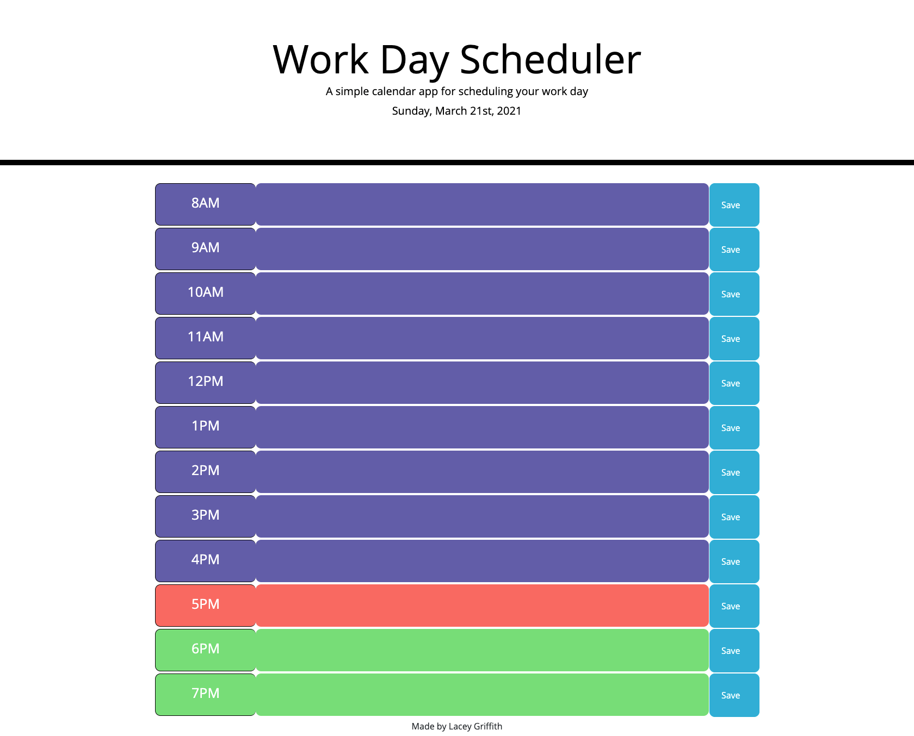

# WorkDay Scheduler

## Description
This application was created for the user with a busy schedule looking to organize their work day by displaying tasks to do each hour. 

## Technologies
*HTML
*CSS
*JavaScript

## Website
https://lacey-griffith.github.io/workday-scheduler/

## Image

## Contributions
Started code provided by the BootCamp (HTML, some CSS)
JavaScript and additional CSS written by Lacey Griffith
